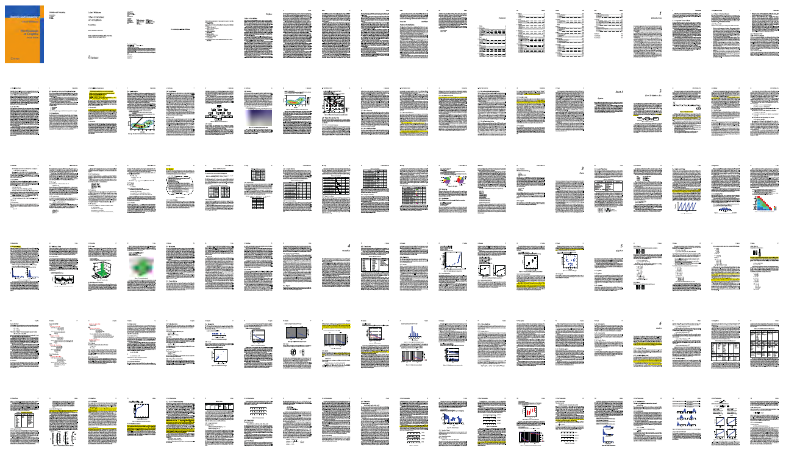
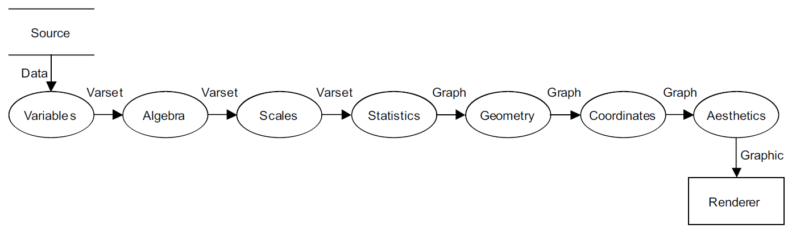
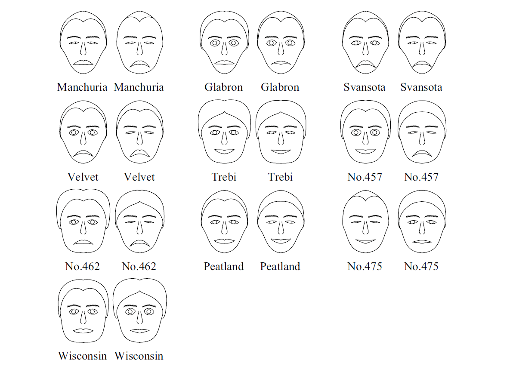

```{r setup, echo=FALSE}
knitr::opts_chunk$set(echo=FALSE,
	             cache=FALSE,
               tidy=FALSE, # tidy up R code
	             dev='svg',
               fig.width=6, fig.height=4)
library(ggplot2)

# Multiple plot function
#
# ggplot objects can be passed in ..., or to plotlist (as a list of ggplot objects)
# - cols:   Number of columns in layout
# - layout: A matrix specifying the layout. If present, 'cols' is ignored.
#
# If the layout is something like matrix(c(1,2,3,3), nrow=2, byrow=TRUE),
# then plot 1 will go in the upper left, 2 will go in the upper right, and
# 3 will go all the way across the bottom.
#
multiplot <- function(..., plotlist=NULL, file, cols=1, layout=NULL) {
  library(grid)

  # Make a list from the ... arguments and plotlist
  plots <- c(list(...), plotlist)

  numPlots = length(plots)

  # If layout is NULL, then use 'cols' to determine layout
  if (is.null(layout)) {
    # Make the panel
    # ncol: Number of columns of plots
    # nrow: Number of rows needed, calculated from # of cols
    layout <- matrix(seq(1, cols * ceiling(numPlots/cols)),
                    ncol = cols, nrow = ceiling(numPlots/cols))
  }

 if (numPlots==1) {
    print(plots[[1]])

  } else {
    # Set up the page
    grid.newpage()
    pushViewport(viewport(layout = grid.layout(nrow(layout), ncol(layout))))

    # Make each plot, in the correct location
    for (i in 1:numPlots) {
      # Get the i,j matrix positions of the regions that contain this subplot
      matchidx <- as.data.frame(which(layout == i, arr.ind = TRUE))

      print(plots[[i]], vp = viewport(layout.pos.row = matchidx$row,
                                      layout.pos.col = matchidx$col))
    }
  }
}
```

## Outline {.titleslide}

1. Types of charts

2. The Grammar of Graphics

3. Examples

# Types of charts

---

```{r scatter}
ggplot(iris) +
  aes(Sepal.Width, Sepal.Length, colour=Species) +
  geom_point() + theme_classic() +
  theme(legend.position="none") +
  xlab("Sepal width") + ylab("Sepal length")
```

---

```{r linegraph}
ggplot(data.frame(y=4*((20:1)+rnorm(20)))) + aes(1:20, y) +
  theme_classic() + theme(legend.position="none") +
  xlab("Time") + ylab("Audience interest") +
  geom_line(size=1, aes(colour="1"))
```

---

```{r barchart}
ggplot(data.frame(count=c(4,40-4), Slides=c("Shown", "Remaining"))) +
  theme_classic() +
  aes(Slides, count, fill=Slides) +
  geom_bar(stat="identity") +
  xlab(NULL) + ylab(NULL) + ggtitle("Slides") +
  theme(legend.position="none")
```

---

```{r piechart}
ggplot(data.frame(count=c(6,40-6), Slides=c("Shown", "Remaining"))) +
  aes(x="", count, fill=Slides) +
  geom_bar(stat="identity", width=1) +
  theme_classic() +
  coord_polar(theta="y") +
  theme(axis.ticks = element_blank(),
        axis.text = element_blank()) +
  xlab(NULL) + ylab(NULL)
```

---

```{r dotplot}
ggplot(faithful) +
  theme_classic() +
  aes(eruptions, fill="1", colour="1") +
  scale_y_continuous(NULL, breaks=NULL) +
  xlab('Eruption duration, mins') +
  geom_dotplot(show.legend=FALSE, binwidth=0.08)
```

---

```{r radar}
coord_radar <- function (theta="x", start=0, direction=1) {
    theta <- match.arg(theta, c("x", "y"))
    r <- ifelse(theta == "x", "y", "x")
    ggproto("CoordRadar", CoordPolar, theta = theta, r = r, start = start, 
        direction = sign(direction),
        is_linear = function(coord) TRUE)
}

ggplot(data.frame(x = c('Speed', 'Price', 'Reliability', 'Comfort', 'Cupholders'),
                  y=round(runif(5*3, 1, 5)),
                  z=rep(letters[1:3],each=5))) +
  aes(x, y, group=z, colour=z) +
  scale_y_continuous(limits=c(0, 5.5), breaks=1:5) +
  scale_x_discrete(limits=c('Speed', 'Price', 'Reliability', 'Comfort', 'Cupholders')) +
  geom_polygon(fill=NA, size=1.5, show.legend = FALSE) +
  coord_radar() +
  theme_classic() +
  theme(axis.ticks.y = element_blank(),
        axis.text.y = element_blank(),
        panel.grid.major.y = element_line(size=.5, colour="#dfdfdf"),
        panel.grid.major.x = element_line(size=.5, colour="#dfdfdf"),
        panel.border = element_blank()) +
  xlab(NULL) + ylab(NULL)
```

---

```{r boxplot}
library(ggthemes)
ggplot(mpg, aes(class, hwy, colour="1")) +
  geom_tufteboxplot(show.legend=FALSE) +
  ylab('Highway miles per gallon') + xlab(NULL) +
  theme_classic() + theme(axis.ticks.y = element_blank()) +
  coord_flip()
```

---

```{r lollipop}
ggplot(data.frame(brand=c('Dairy Milk', 'Galaxy', 'Kit-Kat', 'Mars'),
                  sales=c(490978872, 213379376, 106845438, 98178362))) +
  aes(brand, sales, colour="1", fill="1") +
  geom_bar(stat="identity", width=0.02) +
  geom_point(size=6) +
  scale_y_continuous(labels = function(n) paste0(n/1e6, 'm')) +
  xlab(NULL) + ylab(NULL) +
  theme_classic() + theme(legend.position="none", axis.ticks.x=element_blank())

```

# The Grammar of Graphics

## A book what I readed



---



> "The grammar of graphics determines how **algebra, geometry, aesthetics, statistics, scales** and **coordinates** interact"

---

## Variables

Operations applied **before** scale transformations

- Mathematical transforms (`sin`, `log`)
- Sorting and ranking
- Aggregation
- Quantiles
- Residuals

## Algebra

Let $A := (x,y,z)$ and $B := (a,a,b)$

- **Cross**, $A\times B$
$$ = ([x,y],~[y,a],~[z,b]) $$

- **Nest**, $A/B$  
$$ = (x|a,~y|a,~z|b) $$

- **Blend**, $A+B$
$$ =  (x,y,z,a,a,b) $$


## Scales {data-transition="convex-in none-out"}

- Categorical
- Interval
- Time
- One-bend (log, power)
- Two-bend (arcsine, logit, probit)
- Probability

> "Graphics do not care about the scales on which they are drawn"

## Scales {data-transition="none-in convex-out"}

```{r scalesmonth, fig.height = 0.8}
scalesgg <- ggplot() + theme_classic() + theme(axis.line.x=element_line(), plot.margin=unit(c(1,2,1,2),"lines"))
scalesgg +
  scale_x_continuous(name="Month", breaks=cumsum(c(0,31,28,31,30,31,30,31,31,30,31,30)), limits=c(0,334), minor_breaks=NULL,
                     labels=c('Jan','Feb','Mar','Apr','May','Jun','Jul','Aug','Sep','Oct','Nov','Dec'),
                     expand=c(0,0))
```

```{r scalesweek, fig.height = 0.8}
scalesgg +
  scale_x_continuous(name="Calendar", breaks=c(1:7, 7*(2:4), 2*28), minor_breaks=NULL, limits=c(1,2*28),
                     labels=c(1:7, paste(2:3,'weeks'), '1 month', '2 months'),
                     expand=c(0,0))
```

```{r scalesasn, fig.height = 0.8}
asn <- function(x) 2*asin(sqrt(x))
scalesgg +
  scale_x_continuous(name="Arcsine", breaks=asn(seq(0, 1, by=0.1)), limits=asn(c(0,1)), minor_breaks=NULL,
                     labels=seq(0, 1, by=0.1),
                     expand=c(0,0))
```

## Statistics

**After** scale & variable transformations
<br />**Before** coordinate transformations

- Regression coefficients
- Smoothers
- Binning and aggregation
- Confidence intervals
- Density estimation

## Geometry

Things we can actually see

Functions | Partitions | Networks
--------- | ---------- | --------
point<br>line<br>area<br>interval<br>path<br>schema   | contour<br>polygon    | edge

**Collision modifiers:** stack, dodge, jitter

## Coordinates {data-transition="convex-in none-out"}

> "Ordinary graphics such as intervals and polygons take on radically different
appearances under different planar transformations."

- Cartesian coordinates
- Triangular coordinates
- Polar coordinates
- Map projections
- Conformal mapping

## Coordinates {data-transition="none-in convex-out"}

```{r coord}
stack <- ggplot(diamonds) +
  aes(x = "", fill=cut) +
  geom_bar(width = 1) +
  scale_y_continuous(NULL, breaks=NULL) +
  scale_x_discrete(NULL, breaks=NULL) +
  theme_classic() +
  scale_fill_brewer(type = 'seq')

bullseye <- stack + coord_polar(theta = "x") +
  theme(legend.position = "none")

multiplot(stack, bullseye, cols=2)
```

A new graphic? Or a transformation of an existing one?

## Aesthetics {data-transition="convex-in none-out"}

Form | Surface | Motion | Sound | Text
---- | ------- | ------ | ----- | ----
position<br>size<br>shape<br>rotation<br>resolution | colour<br>texture<br>blur<br>transparency | direction<br>speed<br>acceleration | tone<br>volume<br>rhythm<br>voice | label

> "Much of the skill in graphic design is knowing what combinations
of attributes to avoid."

---



# Putting it all together

## Let's make a pie chart {data-transition="convex-in fade-out"}

`Titanic` dataset

```{r echo=2}
Titanic <- as.data.frame(Titanic)
head(Titanic)
theme_titanic <- function() theme_classic() +
  theme(axis.title=element_blank(),
        axis.text=element_blank(),
        axis.ticks=element_blank())
```

**Algebra:** `Class` &times; `Survived` &times; `Freq`

## Let's make a pie chart {data-transition="fade"}

```{r, echo=TRUE}
(pie <- ggplot(Titanic) +
  scale_x_discrete() + scale_y_continuous() + scale_fill_discrete() +
  geom_bar(width = 1, position = "fill") +
  coord_polar(theta = "y") +
  aes(x = "", fill = Survived, weight = Freq) +
  theme_titanic())
```

## Let's make a pie chart {data-transition="fade"}

```{r echo=TRUE, fig.height=2, out.width='100%'}
pie + facet_grid(. ~ Class)
```

## Let's make a pie chart {data-transition="fade"}

```{r out.width='100%', fig.height=2}
rose <- ggplot(Titanic) +
  scale_x_discrete() + scale_y_continuous() + scale_fill_discrete() +
  geom_bar(width = 1) +
  coord_polar(theta = "x") +
  aes(x = Class, fill = Class, weight = Freq) +
  theme_titanic()
unknown <- rose + coord_polar(theta="y")
multiplot(rose+ggtitle('Rose'),
          unknown+ggtitle('???'),
          cols=2)
```

---


## Napoleon's March {data-transition="convex-in fade-out"}


## Napoleon's March  {data-transition="fade"}

```{r minard, echo=FALSE, out.width='100%', fig.width=10, fig.height=4}
# Source: https://github.com/bborgesr/Stats_Capstone
troops <- read.table("minard-troops.txt", header=T)
cities <- read.table("minard-cities.txt", header=T)
troops$group <- factor(troops$group, levels=3:1) # layer order
troops$variable <- cities$variable <- "map"
temperatures <- data.frame(temp=c(0, 0, -9, -21, -11, -20, -24, -30, -26),
                           long=c(37.6, 36.0, 33.2, 32.0, 29.2, 28.5, 27.2, 26.7, 25.3),
                           date=c('18 Oct','24 Oct','9 Nov','14 Nov','','28 Nov','1 Dec', '6 Dec', '7 Dec'),
                           variable="temp")
theme_minard <- function() {
  theme_classic() +
    theme(axis.text = element_blank(),
          axis.ticks = element_blank(),
          axis.title = element_blank(),
          legend.position="right")
}
scale_minard <- function() {
  list(scale_size_continuous(range = c(0.5, 12), labels=scales::comma,
                             guide = guide_legend(title = 'Survivors')),
       scale_colour_manual(values = c("#E7CAAA", "#CACACA"), labels=c("Advance", "Retreat"),
                           guide = guide_legend(title = 'Direction',
                                                override.aes = list(size=5))))
}

gg <- ggplot(troops, aes(x = long, y = lat))
gg <- gg + geom_path(aes(size = survivors,
                         colour = direction,
                         group = group), lineend = "round")
gg <- gg + geom_text(data = cities, aes(label = city),
                     size = 3, family = "serif", fontface = "italic")
gg <- gg + theme_minard() + scale_minard()
gg
```

```{r minard_code, ref.label='minard', echo=24:30, eval=FALSE, size=1}
```

## Napoleon's March {data-transition="fade"}

```{r minard2, out.width="100%", fig.width=10, fig.height=6}
gg + facet_wrap(~variable, dir="v", scales="free_y") +
  geom_line(data = temperatures, aes(y = temp, colour="R")) +
  geom_text(data = temperatures, aes(y = temp, label = temp),
            parse=TRUE, nudge_x=0.1, nudge_y=+2, family="serif") +
  geom_text(data = temperatures, aes(y = -32, label = date),
            nudge_x=0.1, nudge_y=-2, family="serif", size=3) +
  scale_x_continuous(breaks=temperatures$long) +
  theme(panel.grid.major.x=element_line(colour="#efefef", size=0.2)) +
  geom_text(data = data.frame(variable="temp", long=28, temp=-5), aes(long, temp),
            label="Temperature on return path (degrees Reaumur)", size=5, family="serif") +
  theme(legend.position="none",
        strip.text = element_blank(),
        panel.margin = unit(0, "lines"))
```

## Implementations

- Graphics Production Language (SPSS)
- ggplot2 / ggvis (R)
- Bokeh (Python)
- Gadfly (Julia)
- D3 / [Vega](http://vega.github.io/vega/) (JavaScript)
- Grammarphone (Spotify API)

## Grammarphone

* Implements a `sound` geom for line graphs
* Maps values in data to frequency/volume of music
* Definitely useful
* [**Try it here**](http://angusscott.github.io/GoldsmithHack)

# The End

## References

- Wilkinson, Leland. *The Grammar of Graphics*. 2nd edition. Springer Science & Business Media, 2005.

- Wickham, Hadley. "A layered grammar of graphics". *Journal of Computational and Graphical Statistics* 19.1 (2010): 3--28.
